# ThemeMirror [](https://github.com/vadimdemedes/thememirror/actions/workflows/test.yml)

> Beautiful themes for [CodeMirror](https://codemirror.net/6/)

## Install

```
npm install thememirror
```

## Usage

```js
import {EditorView} from '@codemirror/view';
import {EditorState} from '@codemirror/state';
import {dracula} from 'thememirror';

const state = EditorState.create({
	doc: 'my source code',
	extensions: [dracula],
});

const view = new EditorView({
	parent: document.querySelector('#editor'),
	state,
});
```

## Themes

### Amy

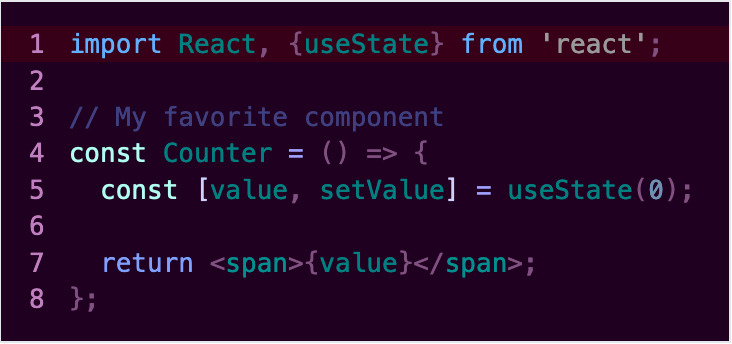

_Author: William D. Neumann_

```js
import {amy} from 'thememirror';
```

### Ayu Light

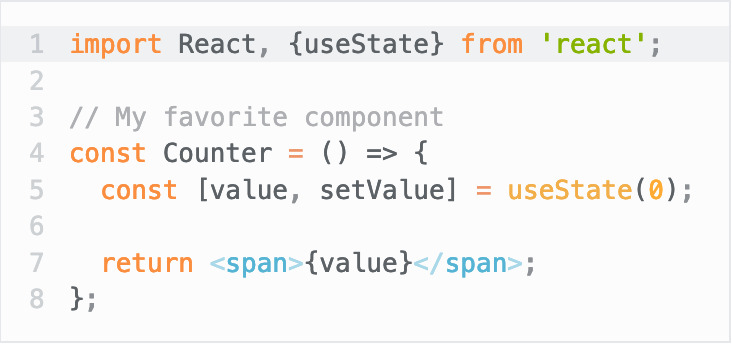

_Author: Konstantin Pschera_

```js
import {ayuLight} from 'thememirror';
```

### Barf

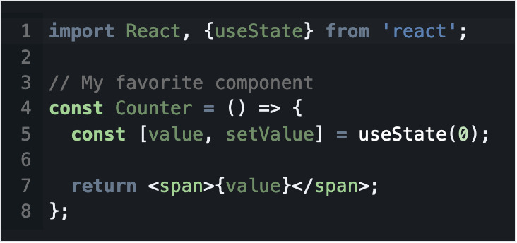

_Author: unknown_

```js
import {barf} from 'thememirror';
```

### Bespin

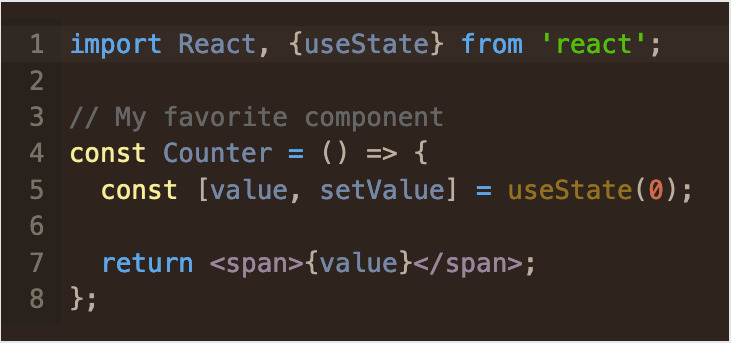

_Author: Michael Diolosa_

```js
import {bespin} from 'thememirror';
```

### Birds of Paradise

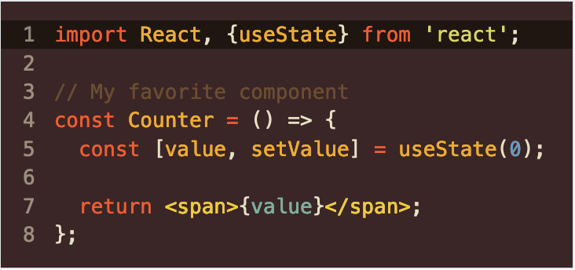

_Author: Joe Bergantine_

```js
import {birdsOfParadise} from 'thememirror';
```

### Boys and Girls

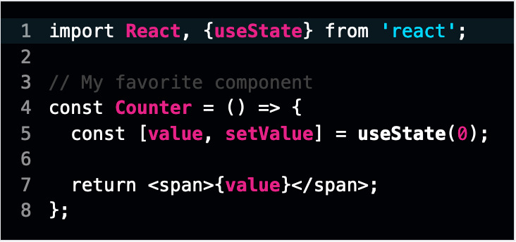

_Author: unknown_

```js
import {boysAndGirls} from 'thememirror';
```

### Clouds

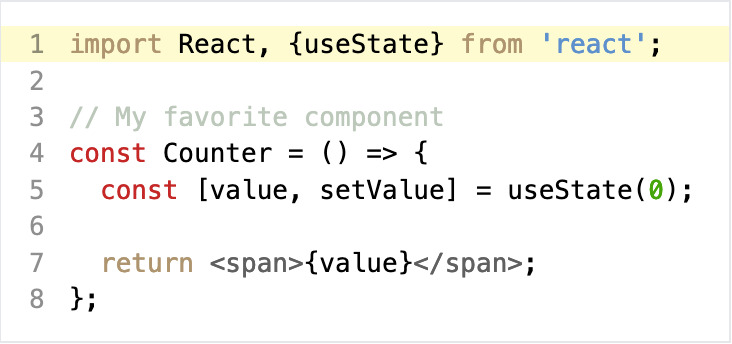

_Author: Fred LeBlanc_

```js
import {clouds} from 'thememirror';
```

### Cobalt

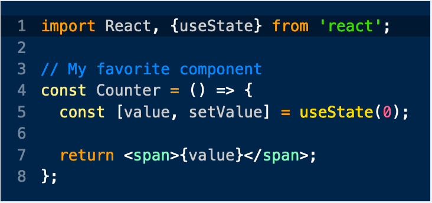

_Author: Jacob Rus_

```js
import {cobalt} from 'thememirror';
```

### Cool Glow

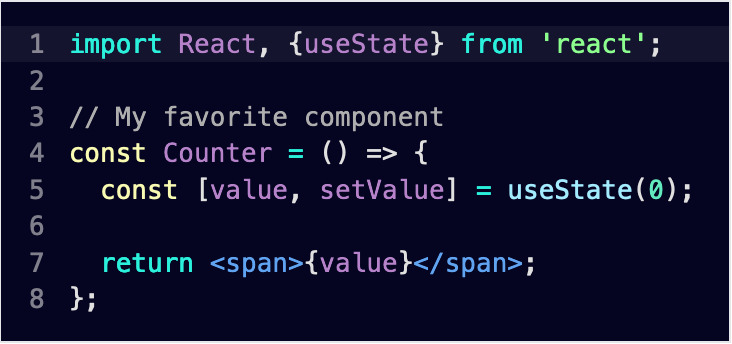

_Author: unknown_

```js
import {coolGlow} from 'thememirror';
```

### Dracula


_Author: Zeno Rocha_

```js
import {dracula} from 'thememirror';
```

### Espresso

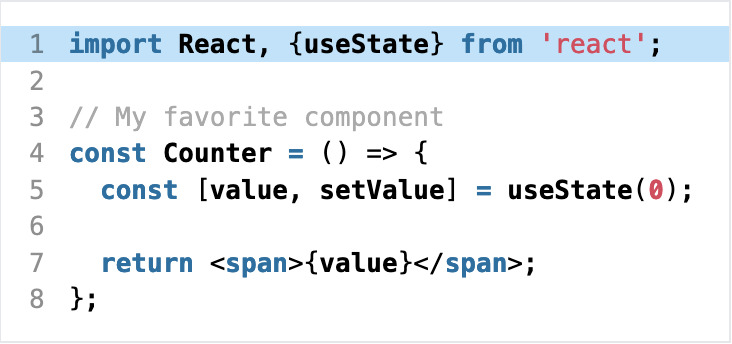

_Author: TextMate_

```js
import {espresso} from 'thememirror';
```

### Noctis Lilac

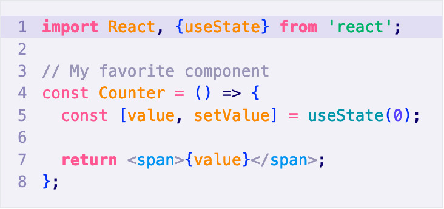

_Author: Liviu Schera_

```js
import {noctisLilac} from 'thememirror';
```

### Rosé Pine Dawn

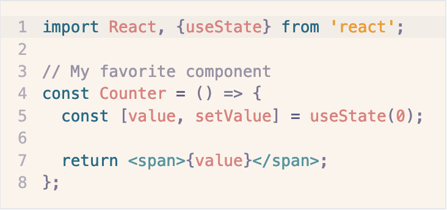

_Author: Rosé Pine_

```js
import {rosePineDawn} from 'thememirror';
```

### Smoothy

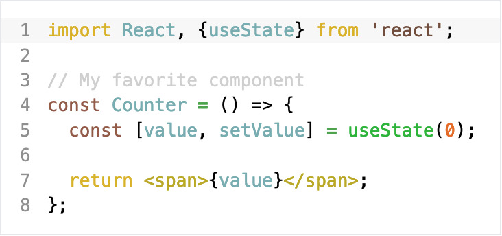

_Author: Kenneth Reitz_

```js
import {smoothy} from 'thememirror';
```

### Solarized Light

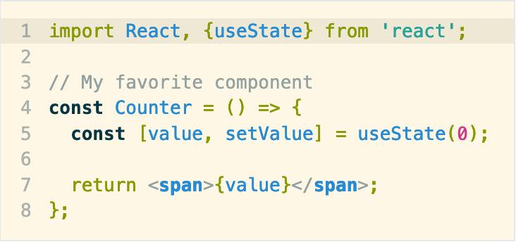

_Author: Ethan Schoonover_

```js
import {solarizedLight} from 'thememirror';
```

### Tomorrow


_Author: Chris Kempson_

```js
import {tomorrow} from 'thememirror';
```

## API

### createTheme(options)

Create your own theme.

#### options

##### variant

Type: `'light' | 'dark'`

Theme variant. Determines which styles CodeMirror will apply by default.

##### settings

###### background

Type: `string`

Editor background.

###### foreground

Type: `string`

Default text color.

###### caret

Type: `string`

Caret color.

###### selection

Type: `string`

Selection background.

###### lineHighlight

Type: `string`

Background of highlighted lines.

###### gutterBackground

Type: `string`

Gutter background.

###### gutterForeground

Type: `string`

Text color inside gutter.

##### styles

Type: `TagStyle[]`

Array of styles to customize syntax highlighting. See [`TagStyle`](https://codemirror.net/docs/ref/#language.TagStyle) for a list of available tags to style.

```js
import {createTheme} from 'thememirror';
import {EditorView} from '@codemirror/view';
import {EditorState} from '@codemirror/state';

const myTheme = createTheme({
	variant: 'dark',
	settings: {
		background: '#00254b',
		foreground: '#fff',
		caret: '#fff',
		selectionBackground: '#b36539bf',
		gutterBackground: '#00254b',
		gutterForeground: '#ffffff70',
		lineHighlight: '#00000059',
	},
	styles: [
		{
			tag: t.comment,
			color: '#0088ff',
		},
	],
});

const state = EditorState.create({
	doc: 'my source code',
	extensions: [myTheme],
});

const view = new EditorView({
	parent: document.querySelector('#editor'),
	state,
});
```
